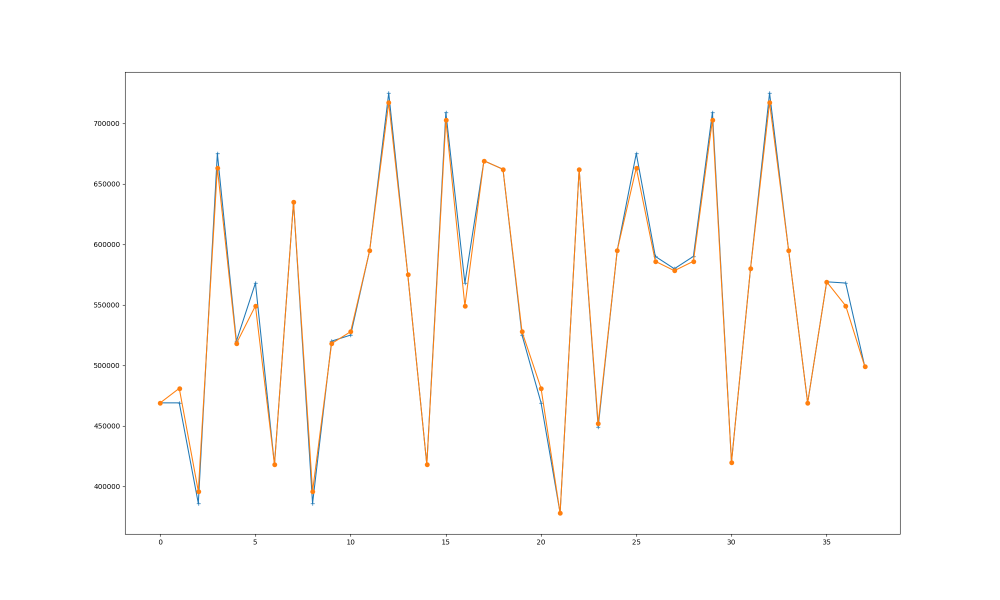
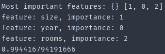

# Roadmap

1. Get more infos for home -> Done
2. Store them in a big file -> Done
3. Switch from file storage to use PostgreSQL -> Done
4. Write simple fastapi to serve the data, with pagination, sorting -> Not done
5. Write simple vue front to call fastapi endpoints -> Done
   6. Have search, pagination, sorting and a map -> Not done
7. Train simple random forest for best home -> Done

## Stretch goals
1. Simplify the extraction and the feeding of the database and the model. 
   2. Right now I am moving json,csv files around.
3. Add search + sorting in the frontend
4. Make the map more useful
   5. popup when hovering the marker
6. Collect more data
7. Get an alert if a deal is detected

# Organisation in packages

## Crawler 
In `extract.py` I manually enter the 1st page with filters I picked
e.g. page = requests.get("https://www.etuovi.com/myytavat-asunnot/helsinki?haku=M2054709531&sivu=1")

Then `extract.py` will extract a light amount of data:
- link
- summary
- price
- year

Once I have that, I can use `extract_more.py`.
Thanks to collecting all the links in the previous steps I can now loop over it.
While looping I can collect more details, and all the images.
For now the additional details are:
- size
- geolocation
- list of images

But we can imagine I want to know, is there a garage? is there a garden? etc.

### Note on geolocation and list of images
Those infos are not available when using requests since they are generated by JS. ( looks like React)
In this case I have two options:
- use something like Puppeteer to have a browser and let is do its job
  - I used that in the past, and it is quite heavy thing to add
- cheat :)
  - I noticed that all the redux state is available
  - which contains the informations I am interested

## Analysis
I want to use random forest to do a data analysis on what is a good deal vs bad deal.
I am using leftovers from a previous project of mine.
https://github.com/loicmasson2/ScrapFlat

I want to:
- what features impact the most the price of a home
- being able to calculate an indicative price
  - meaning what the place SHOULD cost
  - then I can compare with the actual price and determine if it is a deal or not

I used RandomForest, as from previous research it performs quite well for that use case and this amount of data.
The model is quite accurate. But I am most likely using it too naively.  

  

## Backend
Will use FastApi to have a layer on top of DB to serve a frontend.
I am using FastApi + Postgre just to learn.
I am using FastApi endpoints to feed the json generated by the crawled in the database.
Then serve all to the frontend.

https://testdriven.io/blog/fastapi-docker-traefik/

## Frontend
I am using Nuxt with Bun. 
I always wanted to play with Next/Nuxt and to discover Vue.  
